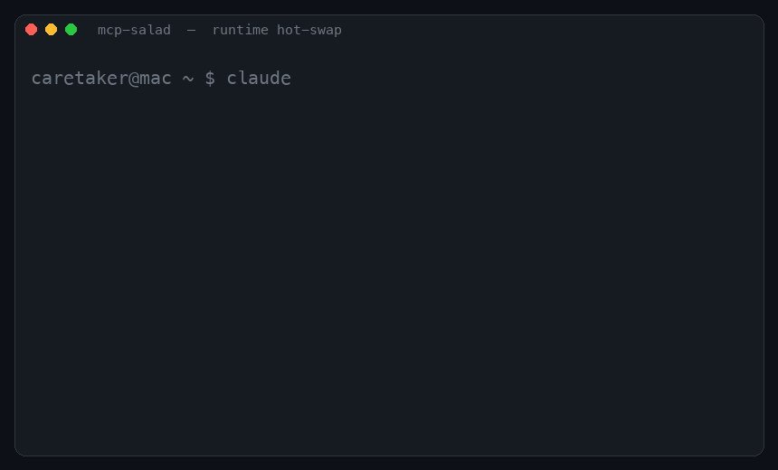

# MCP Salad 🥗

### Hot-swappable MCP servers for Claude Code. Enable or disable them at runtime — no restart.

Powered by the MCP spec's own `notifications/tools/list_changed`. Flip a server on from another terminal and your **already-running** session gains its tools instantly.




**No restart. No polling. Just MCP notifications.**

> The "no restart" part depends on your client honoring `notifications/tools/list_changed`. Recent Claude Code does; support elsewhere varies by client and version. This isn't a new invention — it's the spec's own notification, wired up end to end with a clean enable/disable UX.

### How it compares

|                              | Restart the client | Poll for changes | Load on demand | Unload to save context |
|------------------------------|:------------------:|:----------------:|:--------------:|:----------------------:|
| Edit your `mcp.json` by hand |         ✅          |        —         |       ❌        |           ❌            |
| Most MCP gateways            |         ✅          |        ✅         |       ❌        |           ❌            |
| **MCP Salad**                |         ❌          |        ❌         |       ✅        |           ✅            |

One popular server ships **161 tools (~8k tokens)**. With MCP Salad those tools aren't in your context until you `enable` the server — and you can `disable` it to hand the context back.

## Quick Start

```bash
pip install pyyaml click

# hot-swap: flip a server on/off in a running session (no restart)
salad enable twstock
salad disable twstock

# registry: find and manage servers
salad search finance        # searches curated + the official MCP registry
salad install firecrawl     # curated server, or any name from the official registry
salad list                  # see what you have
salad doctor                # health-check them
salad publish               # submit your own server in ~30s
```

> No install step for the CLI yet — run it as `python3 cli/mcp.py <command>`, or add the one-line `salad` shim (see [Install the `salad` command](#install-the-salad-command)).

### Search spans the official registry

`salad search <query>` now searches **both** the curated local registry and the
[official MCP registry](https://registry.modelcontextprotocol.io) (thousands of
servers). Curated hits are tagged `[curated]`, official hits `[official]`:

```bash
salad search notion                 # both sources (default)
salad search notion --source official   # only the official registry
salad search notion --source local      # curated only, no network
```

`salad install <name>` first checks the curated registry; if it isn't there, it
resolves the name from the official registry, picks the latest active version,
and writes a gateway entry — `remotes` → an HTTP entry, `packages` (npm/pypi/oci)
→ a stdio `command`/`args` entry with any required credentials surfaced as
placeholders. If the network is down or the server can't be mapped, it fails with
a clear message (no traceback).

## Install Servers

Once you have a gateway `config.yaml` (copy from `gateway/config.example.yaml`), you can manage installed servers directly from the CLI:

```bash
# Install a server into your Gateway
python3 cli/mcp.py install firecrawl

# List installed servers
python3 cli/mcp.py list

# Remove a server
python3 cli/mcp.py uninstall firecrawl
```

Set `MCP_GATEWAY_CONFIG=/path/to/your/config.yaml` to point the CLI at your live gateway config.

## Demo

```
$ python3 cli/mcp.py search weather

  Found 2 server(s) matching 'weather':

  open-meteo                 Free weather API — no key required...
  [weather] [api] [forecast]

  weather-gov                Official US National Weather Service data...
  [weather] [us] [forecast]
```

```
$ python3 cli/mcp.py install firecrawl

  Installing: Firecrawl

  Required environment variables:
    FIRECRAWL_API_KEY — Get from firecrawl.dev/app

  Add to Claude Desktop config:

  "firecrawl": {
    "command": "npx",
    "args": ["-y", "firecrawl-mcp"],
    "env": {"FIRECRAWL_API_KEY": "YOUR_KEY_HERE"}
  }

  ✓ Config snippet copied to clipboard!
```

## Browse Servers

| Name | Description | Tags |
|------|-------------|------|
| firecrawl | Web scraping and crawling | web, scraping |
| context7 | Live library documentation | docs, coding |
| pubmed | Biomedical literature search | research, health |
| yahoo-finance | Stock quotes and market data | finance, stocks |
| alpha-vantage | Comprehensive market data API | finance, forex |
| twstock | Taiwan stock market (TWSE/OTC) | finance, taiwan |
| google-maps | Location, directions, geocoding | maps, places |
| obsidian-fs | Read/write your Obsidian vault | notes, pkm |

## Website

The `website/` directory is a static, zero-build site (GitHub Pages compatible). It loads `registry.json` and renders a searchable card grid. Regenerate the JSON after adding servers:

```bash
python3 scripts/build_registry_json.py
```

Then serve locally to preview:

```bash
python3 -m http.server 8000 --directory website
# open http://localhost:8000
```

## Install the `salad` command

The repo ships a tiny `salad` shim so you can type `salad enable twstock` from anywhere:

```bash
git clone https://github.com/cesarlai-alt/mcp-salad
cd mcp-salad
ln -s "$(pwd)/salad" /usr/local/bin/salad   # or any dir on your PATH
salad --help
```

The shim just forwards to `python3 cli/mcp.py`, so every command below works with either form.

## Submit Your Server

Fastest way — let the CLI do it in ~30 seconds:

```bash
salad publish   # prompts for name/description/install, writes the YAML,
                # and opens a pre-filled GitHub submission for you
```

Or [open an issue](../../issues/new?template=submit-server.yml) / send a PR by hand. See [CONTRIBUTING.md](CONTRIBUTING.md) for the YAML format.

## Compatible With

MCP Salad works with any MCP-compatible agent or IDE:

Hot-swap only works where the client honors `notifications/tools/list_changed`, so support is client- and version-dependent:

| Client | Registry/CLI | Runtime hot-swap (`list_changed`) |
|--------|----------|--------------------------|
| [Claude Code](https://claude.ai/code) | ✅ | ✅ on recent versions (support landed through 2026) |
| [Cursor](https://cursor.com) | ✅ | 🔄 untested |
| [Windsurf](https://codeium.com/windsurf) | ✅ | 🔄 untested |
| Any MCP-spec client | ✅ | ✅ if it implements `list_changed` |

The registry/CLI works with any client (it just writes config). The hot-swap is the part that needs client support.

## How this compares (honestly)

This is a tiny, days-old, solo project. There's an official MCP registry (Anthropic + GitHub + Microsoft) and directories indexing tens of thousands of servers — MCP Salad isn't trying to out-register those. The `list_changed` mechanism is straight from the spec; others use it too. What's actually here is a clean **operator hot-swap UX** — flip a whole server on/off, live, from a second terminal — plus a small legible CLI.

For the full competitive picture, honest verdict, and what is / isn't novel, see **[docs/landscape.md](docs/landscape.md)**.

## Two parts, one project

- **Gateway** (`gateway/`) — an MCP router that loads servers on demand and hot-swaps them at runtime via `notifications/tools/list_changed`. It opens a control socket so `salad enable/disable <server>` can flip tools on a live session — no restart.
- **Registry** (`registry/`) — servers indexed in Homebrew-style YAML. The CLI reads and writes your live gateway `config.yaml`, so you never hand-edit YAML: `salad install`, `salad uninstall`, `salad list`, `salad publish`.

## License

MIT
